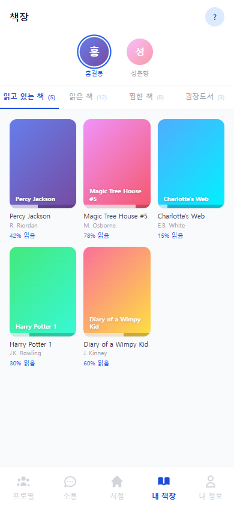
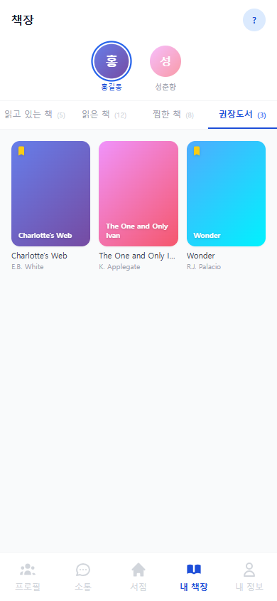

# 책장

책장은 자녀의 도서를 탭별로 관리하는 공간입니다. 읽기 상태별로 분류되어 있어 학습 현황을 한눈에 파악할 수 있습니다.

---

## 프로필 선택 바

화면 상단의 프로필 선택 바에서 확인할 **자녀 프로필**을 선택합니다.

---

## 탭 구성

| 탭 | 설명 |
|----|------|
| 읽고 있는 책 | 현재 읽기가 진행 중인 도서 |
| 읽은 책 | 읽기를 완료한 도서 |
| 찜한 책 | 서점에서 찜해둔 도서 |
| 권장도서 | 부모가 추천한 도서 (노란 북마크 표시) |

### 권장도서 탭

- 부모가 서점에서 추가한 책이 표시됩니다.
- 각 카드 좌측 상단에 **노란 북마크 아이콘**으로 구분됩니다.

---

## 책 상세 패널

책 카드를 탭하면 책 상세 패널이 열립니다. 서점의 상세 패널과 동일한 정보 구조로 표시됩니다.

---

## 책 선택 삭제 모드

여러 권의 책을 한 번에 삭제할 수 있습니다.

### 선택 모드 진입

| 환경 | 방법 |
|------|------|
| 모바일 | 책 카드를 길게 누르기 (500ms) → 선택 모드 진입 + 진동 피드백 |
| 웹 | 카드에 마우스를 올리면 좌측 상단에 체크박스 노출 |

### 선택 모드 UI

- **헤더**: \[취소] / "N권 선택됨" / \[전체선택] · \[전체해제]
- **하단**: 빨간 **"N권 삭제"** 버튼
