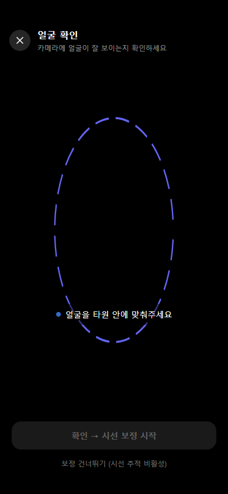

# 시선 보정하기

CheckReading은 시선추적 기술을 사용하여 읽기 집중도를 측정합니다. 정확한 측정을 위해 책 읽기 시작 전 **시선 보정(캘리브레이션)** 을 진행합니다.

---

## 보정 절차

1. **\[책 읽기]** 버튼을 누르면 자동으로 시선 보정 화면이 표시됩니다.
2. 화면에 나타나는 **점을 순서대로 바라봅니다.**
3. 각 점을 바라보는 동안 자동으로 시선이 인식되며, 모든 점이 완료되면 보정이 끝납니다.
4. 보정이 완료되면 자동으로 뷰어 화면으로 이동합니다.


별도의 버튼을 누를 필요 없이 점을 바라보는 것만으로 보정이 자동 완료됩니다.


---

## 재보정 권장 상황

보정 정확도가 낮은 경우 재보정 안내가 표시됩니다. 다음 상황에서는 재보정을 권장합니다.

- 시선이 텍스트와 자주 어긋나는 경우
- 읽기 중 시선 상태가 지속적으로 이탈로 표시되는 경우
- 기기 위치나 자세가 크게 바뀐 경우

---

## 환경 권장 사항

| 상황 | 권장 사항 |
|------|-----------|
| 안경 또는 렌즈 착용 시 | 조명이 충분히 밝은 환경에서 진행 |
| 역광 환경 | 창문이나 조명이 얼굴 뒤에 오지 않도록 조정 |
| 기기 위치 | 눈높이와 화면이 수평에 가깝게 유지 |


어두운 환경이나 강한 역광에서는 시선 인식 정확도가 낮아질 수 있습니다.

