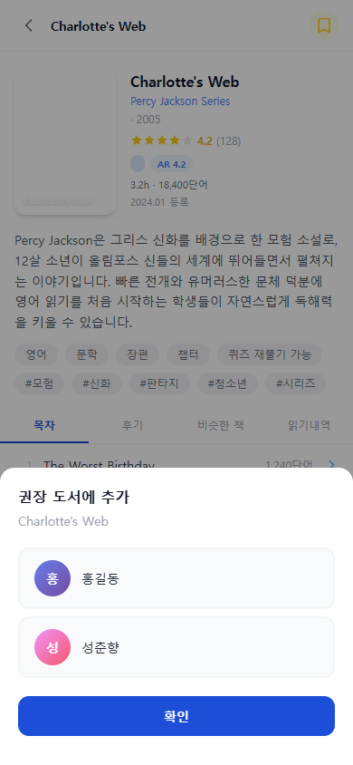

# 권장도서 추가하기

부모는 서점에서 원하는 책을 자녀에게 직접 추천할 수 있습니다. 추천한 책은 자녀 책장의 **\[권장도서]** 탭에 표시됩니다.


권장도서 추가 기능은 **부모 계정**에서만 사용할 수 있습니다.


---

## 추가 절차

1. 서점에서 추천할 책을 탭하여 **책 상세 패널**을 엽니다.
2. 상단의 **북마크 아이콘**을 탭합니다.
   - 이미 추천한 책은 **노란색** 북마크로 표시됩니다.
3. **자녀 프로필 선택 시트**에서 추천할 자녀를 선택합니다.
4. **\[확인]** 버튼을 탭합니다.
5. 이미 추천된 책인 경우 아래 팝업이 표시됩니다.
   > "이미 홍길동에게 추천되어 있습니다. 진행하시겠습니까?"
   - **\[진행]**: 중복 추가
   - **\[취소]**: 추가 취소

---

## 추가 결과

- 추가가 완료되면 자녀 책장의 **\[권장도서]** 탭에 즉시 반영됩니다.
- 권장도서 카드 좌측 상단에는 **노란 북마크 아이콘**이 표시되어 일반 도서와 구분됩니다.
