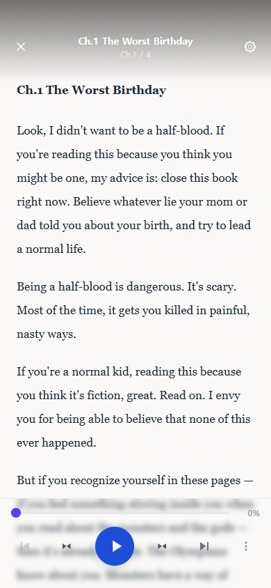

# 뷰어로 책 읽기

시선 보정이 완료되면 뷰어 화면으로 이동합니다. 뷰어는 텍스트를 청크 단위로 표시하고 TTS 음성을 자동 재생하며, 실시간 시선추적으로 읽기 상태를 감지합니다.

---

## 텍스트 표시 및 TTS

- 책의 텍스트는 **청크(chunk) 단위**로 나뉘어 화면에 표시됩니다.
- 각 청크가 표시될 때 **TTS(Text-to-Speech) 음성이 자동으로 재생**됩니다.
- 음성 재생과 텍스트 표시가 동기화되어 읽기 흐름을 유지합니다.

---

## 화면 하단 컨트롤러

화면 하단에는 읽기를 제어할 수 있는 컨트롤러가 표시됩니다.

| 버튼 | 기능 |
|------|------|
| 재생 / 일시정지 | TTS 음성 및 텍스트 진행을 시작하거나 멈춥니다. |
| 이전 챕터 | 현재 챕터의 처음 또는 이전 챕터로 이동합니다. |
| 다음 챕터 | 다음 챕터로 이동합니다. |
| 속도 조절 | TTS 재생 속도를 조정합니다. |

---

## 시선추적 실시간 상태 표시

뷰어에서는 시선추적이 실시간으로 작동하며, 현재 읽기 상태를 색상으로 표시합니다.

| 색상 | 상태 | 설명 |
|------|------|------|
| 녹색 | 읽기 | 텍스트를 정상적으로 읽고 있는 상태 |
| 노란색 | 스캐닝 | 텍스트를 훑어보거나 빠르게 시선이 이동하는 상태 |
| 빨간색 | 이탈 | 시선이 텍스트 영역을 벗어난 상태 |

---

## 읽기 이탈 시 복귀 유도

**자동 시선 맞춤** 설정이 활성화된 경우, 시선이 이탈하면 현재 읽고 있던 문장으로 자동으로 복귀를 유도합니다. 이를 통해 읽기 집중도를 유지할 수 있습니다.


자동 시선 맞춤 설정은 프로필 설정 또는 뷰어 설정에서 켜고 끌 수 있습니다.


---

## 야간 읽기 제한

야간 읽기 제한이 설정된 경우, **지정된 시간 이후에는 읽기가 자동으로 종료**되고 안내 메시지가 표시됩니다.


야간 읽기 제한 시간은 부모 계정의 자녀 프로필 설정에서 지정할 수 있습니다.


---

## 읽기 완료

책 읽기가 완료되면 해당 읽기 세션의 **점수와 통계 요약**이 화면에 표시됩니다.

- 총 읽기 시간
- 집중도 점수 (녹색/노란색/빨간색 비율)
- 챕터별 읽기 현황

요약 확인 후 홈 화면 또는 책장으로 이동할 수 있습니다.
