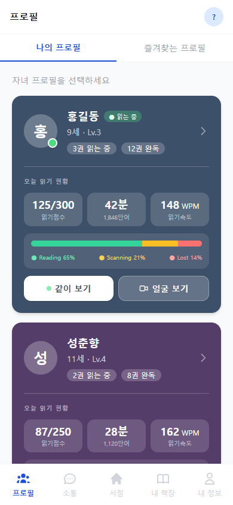
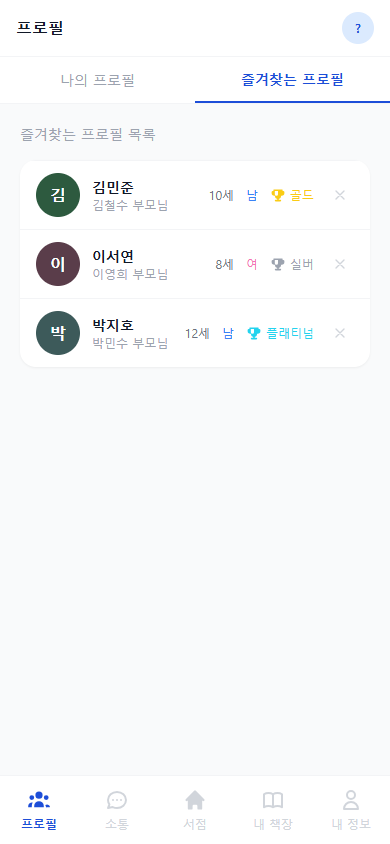

# 프로필 목록 화면

하단 탭바의 **\[프로필]** 탭이 홈 화면입니다. 등록된 자녀 프로필과 즐겨찾기한 프로필을 한눈에 확인할 수 있습니다.

---

## 탭 구성

### 나의 프로필

내가 등록한 자녀 프로필 목록이 표시됩니다.

- 각 자녀 카드에는 오늘의 읽기 현황이 표시됩니다.
  - 점수 / 읽은 시간 / 단어 수 / 시선 상태 바
- 자녀가 현재 온라인 상태인 경우:
  - 카드에 **초록 점** 표시
  - **\[같이 보기]** 버튼: 자녀의 뷰어 화면을 실시간으로 함께 보기
  - **\[얼굴 보기]** 버튼: 자녀 기기 카메라로 얼굴 및 시선 상태 확인

### 즐겨찾는 프로필

즐겨찾기한 다른 사용자의 자녀 프로필 목록이 표시됩니다.

각 행은 다음 정보로 구성됩니다.

| 항목 | 설명 |
|------|------|
| 원형 사진 | 자녀 프로필 사진 |
| 학생명 | 자녀 이름 |
| 나이 | 자녀 나이 |
| 성별 | 자녀 성별 |
| 등급 트로피 | 현재 등급을 나타내는 트로피 아이콘 |

---

## 프로필 추가

우측 상단의 **\[+]** 버튼을 탭하면 **6단계 위자드**를 통해 새 자녀 프로필을 추가할 수 있습니다.

---

## 프로필 상세 이동

카드를 탭하면 해당 자녀의 **프로필 상세** 화면으로 이동합니다.
