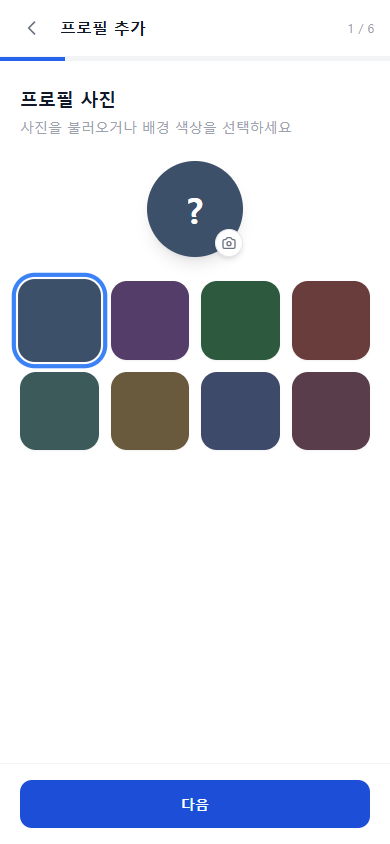
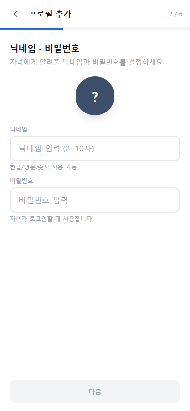

# 자녀 프로필 등록

CheckReading은 한 계정에 여러 자녀 프로필을 등록할 수 있습니다. 프로필 등록은 **6단계 위자드** 형식으로 진행됩니다.

---

## 등록 순서 요약

| 단계 | 내용 |
|------|------|
| 1단계 | 프로필 색상 선택 |
| 2단계 | 닉네임 및 비밀번호 설정 |
| 3단계 | 생년월 선택 |
| 4단계 | 학년 선택 |
| 5단계 | 성별 선택 |
| 6단계 | 선호책 설정 |

---

## 단계별 안내

### 1단계 — 프로필 색상 선택

자녀 프로필에 사용할 색상을 선택합니다. 선택한 색상은 프로필 아이콘 배경에 적용됩니다.


각 단계에서 **파일 불러오기**를 통해 프로필 사진을 직접 업로드할 수 있습니다.


---

### 2단계 — 닉네임 및 비밀번호 설정

- **닉네임**: 자녀가 사용할 이름 또는 별명을 입력합니다.
- **비밀번호**: 프로필 전환 시 사용할 비밀번호를 설정합니다. 입력한 비밀번호는 화면에 그대로 표시됩니다.


비밀번호는 자녀가 직접 기억할 수 있도록 간단한 숫자 또는 단어 조합을 권장합니다.


---

### 3단계 — 생년월 선택

자녀의 출생 연도와 월을 선택합니다.

- **연도**: 2000년부터 선택 가능
- **월**: 1월~12월 중 선택

---

### 4단계 — 학년 선택

자녀의 현재 학년을 선택합니다.

| 구분 | 선택지 |
|------|--------|
| 미취학 | 미취학 |
| 유치원 | 유치원 |
| 초등학교 | 초1, 초2, 초3, 초4, 초5, 초6 |
| 중학교 | 중1, 중2, 중3 |
| 고등학교 | 고1, 고2, 고3 |
| 성인 | 성인 |

---

### 5단계 — 성별 선택

자녀의 성별을 선택합니다.

---

### 6단계 — 선호책 설정

자녀에게 추천할 책의 조건을 태그 방식으로 선택합니다. 항목별로 하나 이상 선택할 수 있으며, 나중에 프로필 설정에서 변경할 수 있습니다.

| 항목 | 선택지 | 기본값 |
|------|--------|--------|
| 언어 | 한국어, 영어 | 한국어 |
| 종류 | 문학, 넌픽션, 기타 | 문학 |
| 분량 | 단편, 중편, 장편 | 모두 선택 |
| 영어책 레벨 | 픽처북, 스토리북, 리더스북, 얼리챕터북, 미들챕터북, 챕터북, 노블 | 학년 기반 자동 선택 |
| 퀴즈 재풀기 | 가능, 불가 | 가능 |


**영어책 레벨 기본값**은 3단계에서 입력한 생년월과 4단계에서 선택한 학년을 바탕으로 자동으로 설정됩니다.


---

## 등록 완료

6단계를 모두 완료하면 **완료 모달**이 표시됩니다. 확인 버튼을 누르면 프로필 목록 화면으로 이동합니다.

추가 자녀 프로필이 필요한 경우 프로필 목록에서 **프로필 추가** 버튼을 눌러 동일한 위자드를 다시 진행할 수 있습니다.
