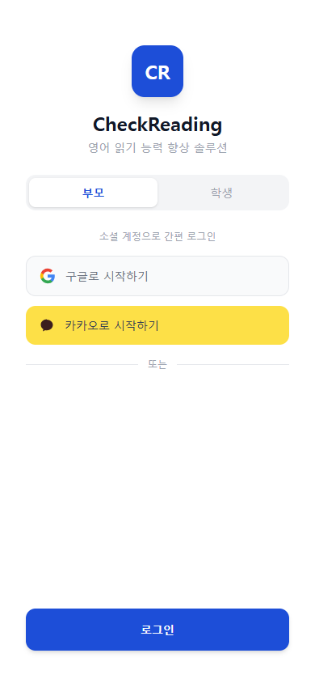
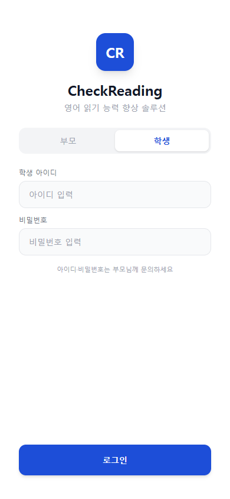

# 가입하기

Check Reading은 부모(보호자)가 먼저 가입한 후, 자녀 프로필을 등록하는 방식으로 시작합니다.

## 부모 가입

로그인 페이지에서 **구글** 또는 **카카오** 계정으로 간편하게 가입할 수 있습니다. 별도의 아이디·비밀번호 생성 없이 소셜 계정으로 바로 시작하세요.

1. 로그인 페이지에서 **구글로 시작하기** 또는 **카카오로 시작하기** 버튼을 누릅니다.
2. 해당 소셜 계정으로 인증을 완료합니다.
3. 가입이 완료되면 자녀 프로필 등록 화면으로 이동합니다.

## 자녀(학생) 로그인

자녀는 부모 계정과 별도로 학생 전용 아이디·비밀번호로 로그인합니다.

1. 로그인 페이지에서 **학생 로그인** 탭을 선택합니다.
2. 부모가 등록한 학생 아이디와 비밀번호를 입력합니다.
3. 로그인 후 할당된 도서 목록에서 책을 선택해 읽기를 시작할 수 있습니다.


학생 아이디와 비밀번호는 부모가 자녀 프로필 등록 시 설정합니다.

